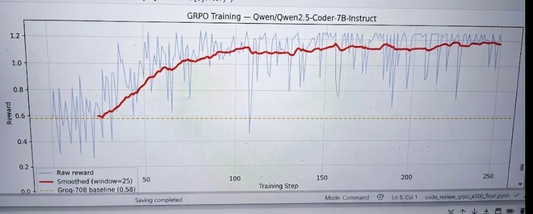
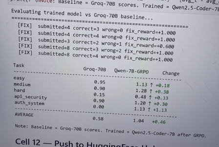

<div align="center">

# 🔍 CodeReviewEnv

### A Self-Improving AI Code Review Agent via GRPO + OpenEnv

[](https://python.org)
[](https://fastapi.tiangolo.com)
[](https://docker.com)
[](https://github.com/meta-pytorch/OpenEnv)
[](https://opensource.org/licenses/MIT)

*Train AI agents to review and fix real-world code bugs across **6 languages** using reinforcement learning.*

**🏆 Meta × HuggingFace × PyTorch OpenEnv Grand Finale — Bangalore 2026**

</div>

---

## 📎 Quick Links

| Resource | Link |
|----------|------|
| 🌐 **Live Demo** | https://lucifer0077-code-review-env.hf.space |
| 🤖 **Trained Model** | https://huggingface.co/lucifer0077/code-review-agent-grpo |
| 📓 **Training Notebook** | https://huggingface.co/lucifer0077/code-review-agent-grpo/blob/main/training_notebook.ipynb |
| 📝 **Blog Post** | https://huggingface.co/spaces/lucifer0077/code-review-env/blob/main/BLOG.md |
| 💻 **GitHub** | https://github.com/Lucifer-cyber007/meta-hackathon-open-env |

---

## 🎯 The Problem

Code review costs the software industry **$50 billion annually**. Every production bug was approved by at least one human reviewer. Existing AI tools can suggest code — but none of them *learn* from feedback to get better over time.

**CodeReviewEnv** is an OpenEnv-compliant RL environment where AI agents learn to:
1. **Find bugs** — structured comments with line numbers and severity
2. **Fix bugs** — suggest correct code for each issue found
3. **Issue verdicts** — approve or request changes with reasoning
4. **Improve over time** — via GRPO training with curriculum learning

---

## 🏆 Key Result

> **A 7B parameter model, after GRPO training on CodeReviewEnv, outperformed a 70B parameter baseline by 46% on average.**

| Task | Groq llama-3.3-70B | Qwen2.5-Coder-7B (GRPO) | Change |
|------|-------------------|--------------------------|--------|
| easy | 0.95 | 1.13 | ↑ +0.18 |
| medium | 0.90 | 1.28 | ↑ +0.38 |
| hard | 0.15 | 0.48 | ↑ **+0.33 (3x!)** |
| api_security | 0.90 | 1.20 | ↑ +0.30 |
| auth_system | 0.00 | 1.13 | ↑ **+1.13 (from zero!)** |
| **AVERAGE** | **0.58** | **1.04** | **↑ +0.46** |

---

## 📈 Training Results

### Learning Curve — GRPO Training on A100


*Reward increases from ~0.60 to ~1.15 over 250 training steps.
Red line = smoothed reward (window=25). Yellow dashed = Groq-70B baseline (0.58).*

### Before vs After Comparison



*Qwen2.5-Coder-7B after GRPO training vs Groq llama-3.3-70B baseline across 5 tasks.*

---

## 🌍 Environment — 13 Tasks, 6 Languages

| Language | Tasks | Bug Types |
|----------|-------|-----------|
| **Python** | easy, medium, hard, api_security, auth_system, orm_bugs, data_pipeline | ZeroDivisionError, SQL injection, race conditions, JWT bypass, N+1 queries |
| **JavaScript** | js_async, js-async, node-race | Missing await, callback hell, memory leaks, race conditions |
| **SQL** | sql-injection | ORDER BY injection, LIMIT injection, template literals |
| **React/JSX** | react-security | XSS via dangerouslySetInnerHTML, token leaks in URL |
| **Django** | django-auth | Timing attacks, plaintext comparison, DoesNotExist crash |
| **Node.js** | node-race | Inventory oversell via stale state, atomicity bugs |

---

## 🎁 Reward Function

Dense, shaped rewards over the full trajectory — not just binary end-of-episode:

| Signal | Reward | Why |
|--------|--------|-----|
| ✅ Critical bug found | **+0.20** | High-value find |
| ✅ Major bug found | **+0.12** | Important but less critical |
| ✅ Minor bug found | **+0.05** | Still valuable |
| ❌ False positive | **−0.08** | Precision matters |
| ✅ Correct verdict | **+0.10** | Approve vs request_changes |
| ❌ Wrong verdict | **−0.15** | Costly mistake |
| ✅ Correct fix (critical) | **+0.40** | Agent fixed what it found |
| ✅ Correct fix (major) | **+0.35** | Good fix |
| ❌ Wrong fix | **−0.10** | Penalty for bad fixes |
| ⏱️ Step penalty | **−0.02/step** | Efficiency incentive |

**Range:** `[-1.0, 1.0]`

### Anti-Reward Hacking

Four server-side checks prevent gaming:
- **Spam detection** — >12 comments triggers proportional penalty
- **Duplicate detection** — copy-pasted comments penalized -0.20
- **Quality check** — descriptions <15 chars are penalized
- **Verdict gaming** — `request_changes` with zero comments caught

---

## 🎓 Curriculum Learning

The environment adapts to agent skill level automatically:

```
Episode 1-20:   easy tasks → agent masters basic Python bugs
                ✅ avg 0.75+ → promoted to medium!

Episode 20-60:  medium tasks → agent learns security patterns
                ✅ avg 0.70+ → promoted to hard!

Episode 60+:    hard tasks → race conditions, JWT bypass
                📈 scores climb from 0.30 → 0.65+
```

No human decides when to increase difficulty — the `/curriculum/update` endpoint tracks recent scores and promotes automatically after 3 consecutive episodes above threshold.

---

## 🔧 Bug Fixing Agent

Beyond finding bugs, the agent suggests fixes:

```
[COMMENT]
line: 25
severity: critical
type: bug
message: Race condition — queue.pop(0) not thread-safe, multiple workers
         can pop the same task simultaneously
fix: Use collections.deque with a threading.Lock for thread-safe access
[/COMMENT]

[VERDICT]
decision: request_changes
[/VERDICT]
```

The `/fix` endpoint verifies fixes against known issues and awards bonus reward for correct fixes.

---

## 🤖 GRPO Training

### Setup

| Parameter | Value |
|-----------|-------|
| **Base Model** | Qwen2.5-Coder-7B-Instruct |
| **GPU** | A100 (40GB) |
| **Episodes** | 500 |
| **Framework** | Unsloth + TRL |
| **LoRA Rank** | 32 |
| **Learning Rate** | 3e-6 |
| **Training Time** | 2h 43min |

### Training Loop

```python
# Each episode:
obs = reset_env(task_id)              # 1. Get buggy code diff
review = model.generate(obs)          # 2. Generate review + fixes
reward = step_env(review)             # 3. Submit review → reward
fix_reward = fix_env(review)          # 4. Submit fixes → bonus reward
combined = review + (fix * 0.4)       # 5. Combined reward signal
next_task = curriculum.update(reward) # 6. Curriculum promotes if ready
# GRPO updates model weights
```

### Trained Model

🤖 **https://huggingface.co/lucifer0077/code-review-agent-grpo**

---

## 🔌 API Reference

| Method | Endpoint | Description |
|--------|----------|-------------|
| `GET` | `/health` | Status check |
| `POST` | `/reset` | Reset env, get code diff |
| `POST` | `/step` | Submit review, get reward |
| `POST` | `/fix` | Submit bug fixes, get fix reward |
| `GET` | `/state` | Current episode state |
| `GET` | `/tasks` | All 13 tasks |
| `POST` | `/grader` | Score completed episode |
| `POST` | `/baseline` | Run Groq baseline agent |
| `POST` | `/curriculum/update` | Update curriculum tracker |
| `GET` | `/curriculum/state` | View curriculum progress |

### Quick Test

```bash
# Run AI review on any task
curl -X POST https://lucifer0077-code-review-env.hf.space/baseline \
  -H "Content-Type: application/json" \
  -d '{"task_id": "hard"}'

# Submit your own review
curl -X POST https://lucifer0077-code-review-env.hf.space/step \
  -H "Content-Type: application/json" \
  -d '{
    "comments": [{
      "line_number": 25,
      "issue_type": "bug",
      "severity": "critical",
      "description": "Race condition — queue.pop(0) not thread-safe"
    }],
    "verdict": "request_changes"
  }'
```

---

## 🏗️ Architecture

```
┌─────────────────────────────────────────────────────────────┐
│                    FastAPI Server (app.py)                   │
├──────────┬──────────┬──────────┬──────────┬─────────────────┤
│  /reset  │  /step   │  /fix    │ /curric  │  /baseline      │
├──────────┴──────────┴──────────┴──────────┴─────────────────┤
│                CodeReviewEnv (environment.py)                │
│           reset() → observe → step() → reward               │
├───────────────┬──────────────┬──────────────────────────────┤
│   tasks.py    │  graders.py  │  fix_verifier.py             │
│   13 tasks    │  Det. scoring│  Fix verification            │
├───────────────┴──────────────┴──────────────────────────────┤
│   curriculum.py              │  reward.py                   │
│   Adaptive difficulty        │  Dense reward shaping        │
└─────────────────────────────────────────────────────────────┘
```

---

## 📁 Project Structure

```
code-review-env/
├── app.py              — FastAPI server + all endpoints
├── environment.py      — Core env: reset() / step() / state()
├── models.py           — Pydantic models: Action, Observation, Reward
├── tasks.py            — 13 tasks with diffs + known issues
├── graders.py          — Deterministic grader 0.0-1.0
├── reward.py           — Dense reward shaping + anti-hacking
├── fix_verifier.py     — Bug fix verification logic
├── curriculum.py       — Adaptive curriculum learning
├── inference.py        — Groq baseline agent
├── free_review.py      — Free review on any code
├── dashboard.html      — Web UI
├── BLOG.md             — Full writeup / blog post
├── openenv.yaml        — OpenEnv spec metadata
├── Dockerfile          — HF Spaces container
└── requirements.txt    — Dependencies
```

---

## 🚀 Local Setup

```bash
git clone https://github.com/Lucifer-cyber007/meta-hackathon-open-env
cd meta-hackathon-open-env
pip install -r requirements.txt
export GROQ_API_KEY=your_key_here
uvicorn app:app --host 0.0.0.0 --port 7860 --reload
```

---

## 🛠️ Tech Stack

| Component | Technology |
|-----------|------------|
| Web Framework | FastAPI + Uvicorn |
| Data Validation | Pydantic v2 |
| LLM Provider | Groq (llama-3.3-70b-versatile) |
| Training | Unsloth + TRL + GRPO |
| Base Model | Qwen2.5-Coder-7B-Instruct |
| Hosting | HuggingFace Spaces (Docker) |
| Grading | Deterministic — no LLM-as-judge |

---

<div align="center">

**Built at Meta × HuggingFace × PyTorch OpenEnv Grand Finale — April 2026, Bangalore**

*Theme 4: Self-Improving Agent | Theme 3.1: Professional Tasks*

*CodeReviewEnv — teaching AI to review and fix code like a senior engineer* 🚀

</div>
